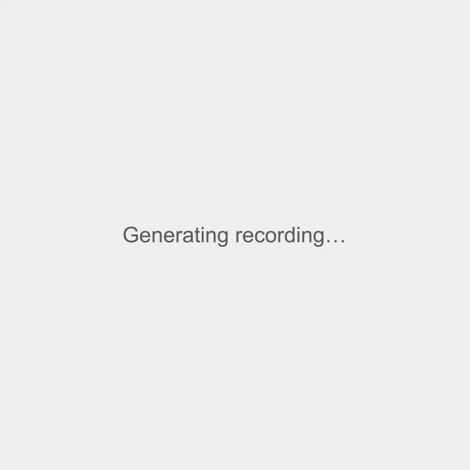

<div align="center">
  

  <a href="https://github.com/raghul-cyber/biogas">
    
  </a>

  <br />

  <!-- Dynamic Badges (Shields.io) -->
  <a href="https://github.com/raghul-cyber/biogas/stargazers">
    
  </a>
  <a href="https://github.com/raghul-cyber/biogas/network/members">
    
  </a>
  <a href="https://github.com/raghul-cyber/biogas/issues">
    
  </a>
  <a href="https://github.com/raghul-cyber/biogas/commits/main">
    
  </a>

  <br />
  <br />

  <!-- Tech Stack Badges -->
  
  
  
  
  

  <br />
  <br />

  ### ⚡ A premium, highly performant web application for modern energy infrastructure.
</div>

---

## 📸 Demo



## ✨ Features

- **Blazing Fast SSG:** Entire site is statically generated at build time (`generateStaticParams`) for instant load times and zero hosting costs.
- **Scrollytelling Timeline:** Horizontal scroll interaction visualizing the closed-loop biomethane conversion process using Framer Motion.
- **Interactive Impact Dashboard:** Custom-themed Recharts `<AreaChart>` rendering dynamic sustainability metrics without hydration mismatches.
- **Filterable Portfolio:** Dynamic project grid with client-side filtering by Feedstock and Project Status.
- **Premium Aesthetics:** Dark charcoal base (`#1f2937`) with amber accents (`#f59e0b`), specifically designed to break away from generic "green tech" tropes.

## 🚀 Getting Started

To run the application locally:

```bash
# 1. Clone the repository
git clone https://github.com/raghul-cyber/biogas.git

# 2. Navigate into the directory
cd biogas

# 3. Install dependencies
npm install

# 4. Start the development server
npm run dev
```
Navigate to [http://localhost:3000](http://localhost:3000) in your browser.

## 🗺️ Roadmap (Completed!)

- [x] **Phase 1 & 2:** Research, Inspiration, and Sitemap Architecture
- [x] **Phase 3:** Project Scaffold & Theme Configuration (Tailwind + Fonts)
- [x] **Phase 4:** Homepage Hero, Counters, and How-It-Works Sections
- [x] **Phase 5:** Filterable Projects Grid & Dynamic Detail Pages (`[slug]`)
- [x] **Phase 6:** Impact/Sustainability Metrics Page (Recharts Integration)
- [x] **Phase 7:** Remaining Utility Pages, Polish & Accessibility Pass
- [x] **Phase 8:** Final QA & Deployment Pre-rendering

## 📈 GitHub Stats

<div align="center">
  
  
</div>

<div align="center">
  
</div>
